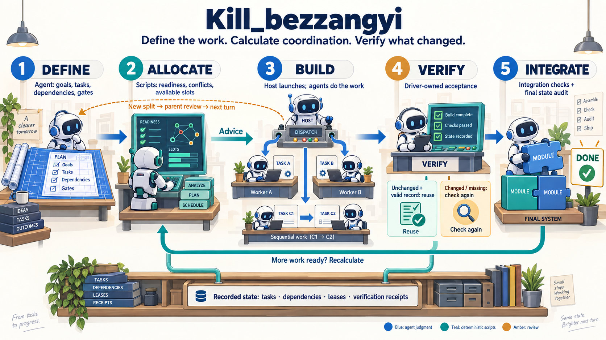

# Kill_bezzangyi

English · [한국어](README.ko.md)

An AI agent can leave requirements unfinished, skip checks, or report completion before the work is actually done. [unlazy](https://github.com/Leonxlnx/unlazy) is a skill built to address that problem. It has the agent define checkable completion criteria before starting, break down larger tasks when needed, and verify the results before reporting. Unfinished work must remain visible rather than disappear behind a confident “done.”

Kill_bezzangyi builds on that completion discipline. It aims to reduce the repeated coordination and verification needed to carry multi-step work through to completion.

Once an agent has broken a task into parts and declared their dependencies, much of the coordination is bookkeeping: which tasks are ready, which can run together, and which results still have valid checks. Kill_bezzangyi puts those decisions into scripts so the model does not have to reason through them again at every handoff.

The agent still defines the work, writes code, and reviews results that need judgment. Scripts calculate the next allocation and check recorded state against explicit rules.



*The host launches agents from the scripts' advice. Verification records can be reused while their declared inputs remain unchanged. Sequential steps can stay with one agent; the illustration shows stages, not a required agent count.*

## Get started

Clone the full repository. The skill uses the scripts, references, and templates alongside `SKILL.md`.

```sh
git clone https://github.com/EESIZ/kill_bezzangyi.git
cd kill_bezzangyi
```

In an agent that can read local files and run commands, provide the path to `SKILL.md` with your task:

```text
Read <path-to-repo>/SKILL.md and follow it for this task:
<describe the result you want and any constraints>
```

If your agent supports installed skills, add this directory through its skill-loading mechanism. The skill name is `kill-bezzangyi`.

The agent starts by recording observable completion conditions in `GATES.md`. A focused task stays with one agent. Work with independent parts can use a plan and separate workers, with the driver responsible for accepting their results and checking the combined outcome.

### Requirements

- Node.js 16 or later for the scripts, tests, and optional Stop hook.
- No external runtime packages; the scripts use the Node.js standard library.
- An agent that can read `SKILL.md`. Parallel work also requires native subagent support in the host.
- Any tools used by a gate's `CHECK` command must be available on `PATH`.
- The optional Stop hook is for Claude Code. Cloning the repository does not install it.

## What changes from unlazy

| Area | Kill_bezzangyi behavior |
|---|---|
| Next-task selection | Calculates ready tasks from declared dependencies, read/write access, shared resources, active claims, and available slots. Returns compact launch, wait, or review advice. |
| Splitting and regrouping | Records changes with stable operation IDs, supports recovery, and checks that task obligations and parent integration gates remain accounted for. |
| Splits discovered during work | A worker reports the split. The parent confirms the worker has stopped, reviews the handoff, and can redistribute the work in a later logical turn. |
| Acceptance checks | The driver runs official acceptance. Workers run development tests as needed without a mandatory duplicate of the full acceptance suite. |
| Repeated verification | Reuses an accepted result only when its declared inputs and verification context remain current. Checks at the actual integration point still run. |

For example, after two independent components pass acceptance, a parent can check their current verification records and test how the components work together. It does not need to rerun both component suites just because the results moved up the task tree. If the relevant inputs change, acceptance must be refreshed.

The existing gate runner, command approval mechanism, and scan-only Stop hook remain. The new profile changes when verification runs and when current evidence can be reused.

## Equations and research foundations

The rules below describe the implementation, not an estimate of how hard a task will be for an LLM. Some use established algorithms; others are project-specific invariants. The cited research does not validate this skill's token savings.

Let $G=(V,E)$ be the declared task graph, with $u\to v$ meaning that $v$ needs $u$. Write $u\leadsto v$ when a dependency path connects them.

### 1. Can two tasks run together?

For task $i$, let $R_i$ and $W_i$ be its declared read and write sets, including separately identified shared resources.

$$
B(i,j) \iff
W_i\cap W_j=\varnothing
\;\land\; W_i\cap R_j=\varnothing
\;\land\; R_i\cap W_j=\varnothing
$$

$$
\mathrm{Independent}(i,j)
\iff B(i,j)\land\neg(i\leadsto j)\land\neg(j\leadsto i)
$$

Two tasks may read the same input. They cannot independently modify the same resource or consume something the other is modifying. We also reject pairs with a dependency path.

**Foundation:** A. J. Bernstein, *Analysis of Programs for Parallel Processing* (1966), [DOI](https://doi.org/10.1109/PGEC.1966.264565). The [HPF specification](https://hpff.rice.edu/versions/hpf2/hpf-v20/node68.html) documents these conditions. Our dependency-path test and conservative file-pattern matching adapt them to task allocation; complete access declarations remain essential. **Code:** [conflicts / schedule](scripts/lib/schedule.mjs).

### 2. What can start next?

Let $D_t$ be verified tasks, $U_t$ unfinished tasks not currently active, and $L_t$ tasks still holding an ownership lease.

$$
Q_t=\{v\in U_t:\mathrm{Pred}(v)\subseteq D_t
\land \mathrm{Pred}(v)\cap L_t=\varnothing\}
$$

The scheduler scans candidates in stable task-ID order. It selects mutually independent tasks that also avoid active-task and lease conflicts, subject to:

$$
|S_t|\leq\max(0,k-|A_t|)
$$

Here $S_t$ is the new selection, $A_t$ the active set, and $k$ the slot limit. State inconsistencies require review instead of dispatch.

**Foundation:** A. B. Kahn, *Topological sorting of large networks* (1962), [DOI](https://doi.org/10.1145/368996.369025). The implementation uses Kahn's traversal to reject dependency cycles. Readiness, leases, and greedy selection are project rules, not Kahn's scheduling policy. It does not find a globally optimal allocation. **Code:** [parsePlan / schedule](scripts/lib/schedule.mjs).

### 3. When can task groups be combined?

Let $\mathcal P$ partition the tasks into groups, and $G/\mathcal P$ be the graph whose nodes are those groups. A proposed merge must preserve an acyclic group graph. Within the merged group $M$, every pair of distinct unfinished tasks must have a dependency order:

$$
\mathrm{DAG}(G/\mathcal P')
\quad\land\quad
\forall u\ne v\in M_{\mathrm{unfinished}},
\;(u\leadsto v)\lor(v\leadsto u)
$$

The implementation also refuses to regroup active or leased tasks. Grouping does not delete tasks or mark them complete.

**Conceptual basis:** Herrmann et al., *Acyclic partitioning of large directed acyclic graphs*, Inria RR-9163 (2018), [author-institution copy](https://research.sabanciuniv.edu/35222/1/RR-9163.pdf). We use the requirement that grouping preserve acyclicity, not the paper's multilevel partitioner or its performance results. The unfinished-task rule above is our own policy. **Code:** [calculateStructure](scripts/lib/structure.mjs) and [independent structural checks](scripts/lib/structure-check.mjs).

### 4. What does “complexity” measure here?

The structure planner reports three counts:

$$
C=(|\mathcal P|,\ |E_{\mathcal P}|,\ d_{\max})
$$

They are the number of groups, the number of distinct directed connections between groups, and the maximum recorded split depth. Depth is calculated recursively:

$$
d(v)=
\begin{cases}
0 & \text{if no split is recorded for }v\\
1+\max_{c\in\mathrm{children}(v)}d(c) & \text{otherwise}
\end{cases}
$$

**Project-defined metric.** This describes the declared structure; it does not predict tokens, failure probability, or how many undiscovered subtasks remain. It is not a published LLM complexity formula and does not automatically choose split depth. **Code:** the complexity result in [calculateStructure](scripts/lib/structure.mjs).

### 5. How do we prevent lost work and duplicate changes?

After adding children $C_{\mathrm{new}}$ to a retained parent, the task inventory and group assignment must satisfy:

$$
V'=V\cup C_{\mathrm{new}},
\qquad
\biguplus_{P\in\mathcal P'}P=V'
$$

The disjoint union means every task belongs to exactly one group. Existing task IDs, dependencies, and Gate definitions must survive the transition. Final checks also reject unfinished tasks, unresolved reports, active workers, and remaining leases.

For a successfully applied structural event $e$, retrying the same operation ID and payload leaves the persisted state unchanged:

$$
T_e(T_e(S))=T_e(S)
$$

A reused ID with a different payload is rejected. New structural events advance the logical turn; retries do not. A split report can be accepted only in a later turn, after its return, stop confirmation, review, and lease release.

**Project-defined invariants and idempotent transaction rules**, not a formula copied from a particular paper. They check recorded state; they cannot prove that an agent declared all required work or actually stopped an OS process. **Code:** [verifyTransition](scripts/lib/structure-check.mjs), [applyStructure / recovery](scripts/lib/structure-store.mjs), and [handoff rules](references/handoff.md).

### 6. When can a passed check be reused?

For receipt-backed acceptance, the core audit rule is:

$$
\mathrm{Reuse}
=\mathrm{Accepted}\land\mathrm{Closed}\land\mathrm{AllGatesMet}
\land(H_{\mathrm{context}}=H_{\mathrm{saved}})
\land(H_{\mathrm{ledger}}=H_{\mathrm{savedLedger}})
$$

The SHA-256 context fingerprint covers declared input contents, verification policy, Gate definitions, scoped contract revision, checker code, and runtime/environment inputs. The ledger fingerprint also binds recorded evidence. When a caller supplies an expected policy, that must match too.

**Related research:** Mokhov, Mitchell, and Peyton Jones, *Build Systems à la Carte* (ICFP 2018), §4.2.2, [author-hosted paper](https://simon.peytonjones.org/assets/pdfs/build-systems-original.pdf). Its verifying traces use recorded hashes to determine whether results remain current. Our acceptance receipts are a project-specific application of that general idea, not a reproduction of the paper's build system. Complete, deterministic inputs and stopped writers must be declared; hash equality does not establish those assumptions. **Code:** [context / inspectReceipt](scripts/lib/verification.mjs) and [acceptance runner](scripts/verify-once.mjs).

## What we measured

We compared three versions: **A**, the original unlazy baseline; **B**, the initial Kill_bezzangyi implementation; and **C**, the current minimal-verification version.

| C compared with B | Total tokens | Elapsed time |
|---|---:|---:|
| Next-task allocation trials | −45.1% | −31.2% |
| Full implementation trials | −0.25% | −3.0% |

The clearest improvement was in deciding what to run next. Against original unlazy (A), C used 43.4% fewer tokens in allocation trials, but **79.6% more tokens across full implementation trials**. A used no subagents in those full-task trials; B and C did in some runs. The comparison therefore includes different execution strategies.

Each version passed the observed checks in 16 full-task trials and 16 allocation trials. C also passed 282 regression checks before the experiment. These results do not establish equal quality or a general cost advantage: each case ran twice, C ran after the preserved A/B trials, and token counts were not converted into billing costs.

See the [full comparison report, in Korean](research/comparison-ABC-results-20260923.md) and the [measurement protocol, in Korean](research/comparison-protocol.md).

## Boundaries

The scripts work from facts the agent declares. They do not discover every dependency, prove that a task was decomposed correctly, or guarantee that parallel execution will be cheaper.

Verification reuse requires a complete, deterministic set of declared inputs and no concurrent writers. That is an explicit declaration, not something the script can infer. If those conditions cannot be established, checks run fresh. Required manual review and integration checks remain part of completion.

The host still launches and stops agents. This repository does not implement a fully automatic execution controller. The Stop hook scans recorded state; it does not continuously watch artifacts for changes.

## Reference and development

- [Skill instructions](SKILL.md)
- [Scheduling](references/scheduling.md)
- [Recursive splits and regrouping](references/structure.md)
- [Worker handoffs](references/handoff.md)
- [Minimal verification](references/minimal-verification.md)
- [Gate format and checks](references/gates.md)
- [Security and command approval](SECURITY.md)

Run the test suite from the repository root; no package installation is needed:

```sh
npm test
```

For contributions, describe the problem and proposed behavior before making architectural changes. Include relevant regression tests for behavior changes. Project decisions and work reports live in [`mydocs/`](mydocs/).

## License and attribution

Derived from [Leonxlnx/unlazy](https://github.com/Leonxlnx/unlazy), baseline commit `16671491f6679ad9378f52604d3bc2415b4120c7` (upstream package version 2.1.0).

Released under the [MIT License](LICENSE), with the original copyright and permission notice preserved. See [NOTICE.md](NOTICE.md) for attribution and fork details. `.unlazy/` paths and `UNLAZY_*` variables remain as compatibility identifiers.
